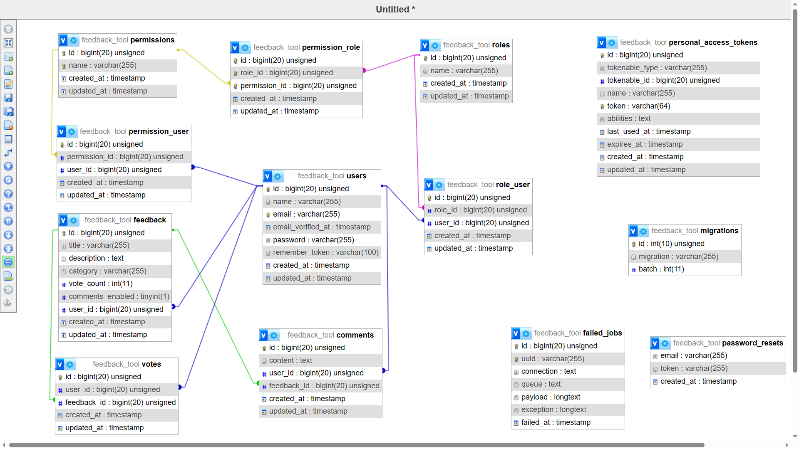

# Feedback Tool

The **Feedback Tool** is a Laravel 9 project designed to manage user feedback for an online platform.

## Setup

### Prerequisites

Make sure you have the following installed:

- [Composer](https://getcomposer.org/)
- [PHP](https://www.php.net/)

### Installation

1. **Clone the repository:**

    ```bash
    git clone https://github.com/malikkbilal/Feedback-Web-Tool.git
    ```

2. **Navigate to the project directory:**

    ```bash
    cd feedback_tool
    ```

3. **Install PHP dependencies:**

    ```bash
    composer install
    ```
4. **Create a copy of the `.env.example` file and rename it to `.env`:**

    ```bash
    cp .env.example .env
    ```

5. **Generate the application key:**

    ```bash
    php artisan key:generate
    ```

6. **Update the `.env` file with your database credentials and other configurations.**

7. **Run the migration to create the database tables:**

    ```bash
    php artisan migrate
    ```

8. **Seed the database with sample data:**

    ```bash
    php artisan db:seed
    ```

9. **Start the development server:**

    ```bash
    php artisan serve
    ```

Visit [http://localhost:8000](http://localhost:8000) in your browser to access the application.

### Postman Collection

For API testing, i have provided Postman collection file: [feedback_tool.postman_collection.json](https://github.com/malikkbilal/Feedback-Web-Tool/blob/main/feedback-tool-collection.postman_collection.json).

### Database Backup

A backup of the database is also available in the `db_backup` directory.

## Entity Relationship Diagram (ERD)



...
